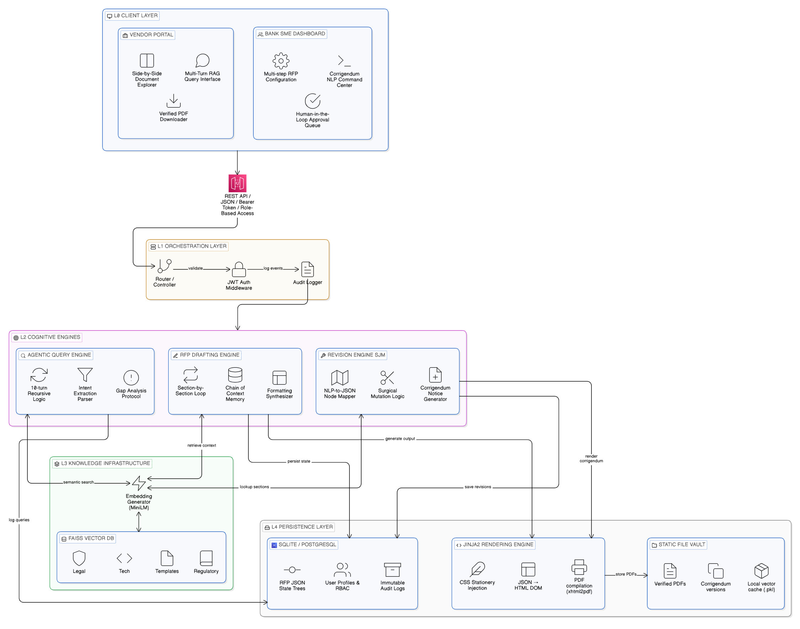
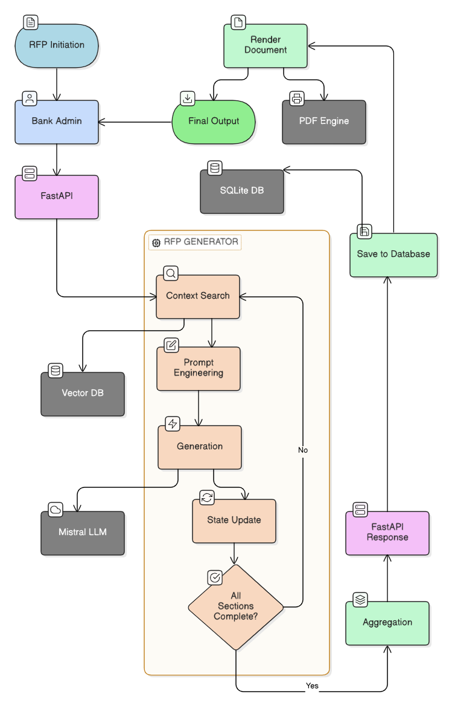
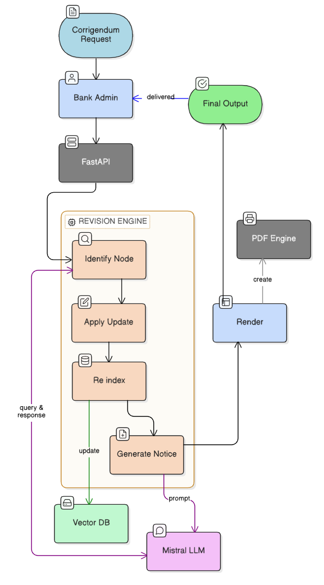
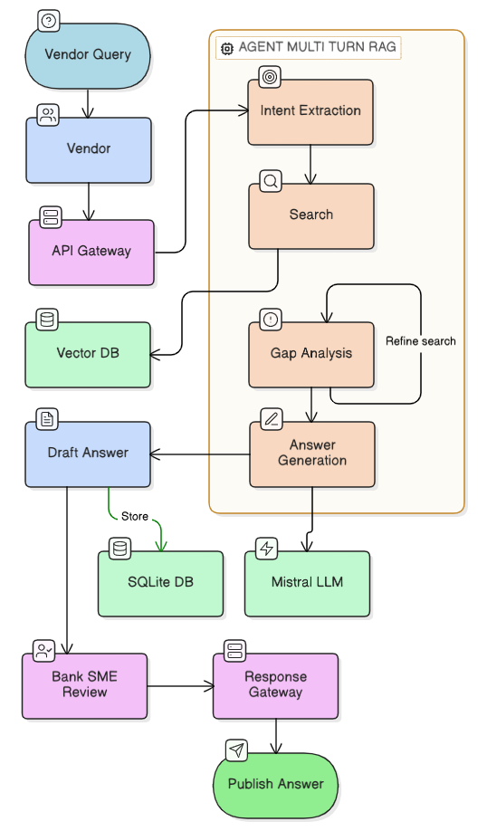

```mermaid
sequenceDiagram
    participant B as Bank Admin
    participant S as FastAPI Server
    participant DB as SQLite
    participant V as FAISS Vector Store
    participant L as Mistral LLM
    participant P as PDF Generator

    %% Milestone 1
    rect rgb(30, 41, 59)
    Note over B, P: Milestone 1: Automated RFP Drafting
    B->>S: Submit Project Parameters & Expert Config
    S->>V: Retrieve Bank Standards (Legal, Tech, etc.)
    V-->>S: Relevant Institutional Context
    S->>L: Context + Project Config Prompt
    L-->>S: Structured JSON RFP Array
    S->>DB: Save Draft Status
    S->>P: Render Formal Jinja2 PDF
    S-->>B: Return Generated Draft
    end

    %% Milestone 2
    rect rgb(15, 23, 42)
    Note over B, L: Milestone 2: Query Resolution Workflow
    participant Ven as Vendor
    Ven->>S: Submits Clarification Query
    S->>V: Search Published Document Embeddings
    V-->>S: Relevant Chunks / Context
    S->>L: Document Context + Vendor Question
    L-->>S: Grounded AI Proposed Answer
    S->>DB: Save as "Pending Approval"
    S-->>Ven: Acknowledge Receipt
    S-->>B: Notify of Pending Query
    B->>S: Review AI Output -> Accept/Edit -> Publish
    S->>DB: Mark "Answered"
    S-->>Ven: Display Official Answer
    end

    %% Milestone 3
    rect rgb(30, 41, 59)
    Note over B, P: Milestone 3: Automatic Corrigendum Generation
    B->>S: Submit Natural Language Changes
    S->>L: Original RFP JSON + Change Prompt
    L-->>S: Surgically Updated RFP JSON
    S->>L: Original + New + Prompt
    L-->>S: Formal Corrigendum Legal Notice
    S->>DB: Save New Version & Notice
    S->>V: Clear Cache & Re-index Updated Document
    S->>P: Render Updated RFP PDF
    S-->>B: Return Corrigendum Package
    end
```

# 🏦 RFPilot: Procurement on Autopilot

---

## 📌 Table of Contents

1. [Introduction](#intro)
   - [Problem Statement](#problem-statement)
   - [Solution](#solution)
2. [Project Overview](#overview)
3. [Key Features](#features)
4. [System Architecture](#architecture)
5. [Logic Flowcharts](#flowcharts)
6. [Milestone Handling Workflow](#workflow)
7. [Tech Stack](#tech-stack)
8. [Installation & Setup](#setup)
9. [Use Cases](#use-cases)
10. [Visual Gallery](#gallery)
11. [Key API Endpoints](#api)
12. [Project Structure](#structure)

---

## <a id="intro"></a>💡 1. Introduction

### <a id="problem-statement"></a>Problem Statement
The traditional banking RFP (Request for Proposal) lifecycle is broken. It is slow, highly manual, and prone to regulatory errors.
*   **Drafting Takes Weeks:** Manually aligning technical specs with 500+ pages of RBI Master Directions is tedious and creates massive compliance risks.
*   **Query Bottlenecks:** Answering hundreds of repetitive or complex vendor questions drains SME (Subject Matter Expert) bandwidth and delays procurement.
*   **Corrigendum Chaos:** A single clause or deadline change requires rewriting and redistributing the entire PDF, leading to versioning nightmares.

---

### <a id="solution"></a>Solution
**RFPilot** transforms procurement from static text generation into **Autonomous Document Engineering**. 
Instead of relying on a standard, error-prone AI chatbot, we engineered a specialized Cognitive Architecture designed specifically for institutional rigor.

To deliver this level of precision, our platform treats every RFP as a **"Structured Intelligence Object,"** featuring:
*   **Autonomous RFP Drafting:** Generates comprehensive, regulatory-compliant RFPs in minutes.
*   **Isolated Database Silos:** Completely eliminates cross-domain hallucination.
*   **Specialized AI Agents:** Handles complex, multi-turn reasoning for vendor queries.
*   **Precise Document Mutation:** Performs surgical updates without breaking the original document structure.
*   **Rigorous Human-in-the-Loop (HITL):** Ensures bank oversight and 100% regulatory compliance.

---

## <a id="overview"></a>📄 2. Project Overview
**RFPilot** is a specialized, end-to-end GenAI platform designed to autonomously manage the high-stakes lifecycle of banking Request for Proposals (RFPs). 

In institutional banking, drafting an RFP is not merely about writing a document, it is about synthesizing complex legal frameworks, strict regulatory mandates (such as the RBI Master Directions), and dense technical specifications into a single, cohesive contract. Traditionally, this process requires cross-departmental coordination (Legal, Procurement, IT) and takes anywhere from 30 to 45 days.

**RFPilot fundamentally disrupts this workflow.** It moves beyond the capabilities of generic LLM chatbots to provide a **deterministic, regulatory-dense document engine**. It allows banks to:
1. **Autonomously Draft** comprehensive, 100+ page RFPs in minutes based on simple project parameters.
2. **Resolve Vendor Queries** instantly using a secure, multi-turn RAG (Retrieval-Augmented Generation) agent that grounds its answers solely in the bank's verified knowledge base.
3. **Issue Surgical Corrigenda** (amendments) without manually rewriting or breaking the original document structure.

By treating the RFP as a "Structured Intelligence Object" rather than plain text, RFPilot ensures 100% compliance with institutional standards while reducing procurement cycles from months to minutes.

---

## <a id="features"></a>✨ 3. Key Features

### 1️⃣ Autonomous RFP Drafting Engine
*   **Chain-of-Context Memory**: Drafts 11-section documents sequentially, remembering timelines and budgets from Section 1 to ensure Section 11 (Penalties) aligns perfectly.
*   **Expert Configuration Mode**: Allows bank admins to inject specific institutional constraints (e.g., "Must comply with zero-trust architecture") directly into the prompt.
*   **Jinja2 PDF Rendering**: Outputs a highly professional, formatted PDF complete with institutional CSS stationery, ready for immediate vendor distribution.

### 2️⃣ Multi-Silo RAG Infrastructure
*   **Cognitive Siloing**: Vectors are split into 5 distinct databases (Legal, Technical, Compliance, Procurement, Templates) to completely eliminate cross-domain hallucination.
*   **Regulatory Injection**: Automatically grounds requirements in the latest uploaded RBI Master Directions and World Bank frameworks.

### 3️⃣ Intelligent Vendor Query Portal (Agentic RAG)
*   **Multi-Turn Reasoning**: Deploys a recursive agent (up to 10 turns) to dissect complex vendor queries, search the RFP, analyze gaps, and refine its search before answering.
*   **Human-in-the-Loop (HITL) Validation**: The AI drafts the response, but a Bank SME must review, edit, and click "Approve" before it is published, ensuring zero legal liability.
*   **Intent Extraction**: Analyzes if a question is Mathematical, Policy-Based, or Administrative to route it to the optimal reasoning logic.

### 4️⃣ Surgical Corrigendum Management (SJM)
*   **Structured JSON Mutation**: Modifies active RFPs using NLP (e.g., "Delay deadline by 5 days") by altering specific JSON nodes rather than rewriting the entire document, preserving structural integrity.
*   **Automated Legal Notices**: Generates an official, side-by-side "Original vs. Revised" Corrigendum Notice PDF for complete transparency.
*   **Auto-Vector Sync**: Instantly clears and re-indexes the Vector Store upon document modification so the Query Engine is always using the absolute latest version.

### 5️⃣ Institutional Audit & Security
*   **Immutable Ledger**: Cryptographically logs every action from initial draft generation to query approvals and corrigendum issuances.
*   **Role-Based Access Control (RBAC)**: Distinct, isolated frontend portals for Bank Admins vs. Vendors.

---

## <a id="architecture"></a>🏗️ 4. System Architecture

<p align="center">
  
</p>

---

## <a id="flowcharts"></a>🛤️ 5. Logic Flowcharts

<table width="100%" style="border-collapse: collapse;">
  <tr>
    <td width="33%" align="center" valign="bottom"><b>1. RFP Generation Flow</b></td>
    <td width="33%" align="center" valign="bottom"><b>2. Corrigendum Flow</b></td>
    <td width="33%" align="center" valign="bottom"><b>3. Vendor Query Flow</b></td>
  </tr>
  <tr>
    <td align="center" valign="middle"><br></td>
    <td align="center" valign="middle"><br></td>
    <td align="center" valign="middle"><br></td>
  </tr>
</table>

---

## <a id="workflow"></a>🔄 6. Milestone Handling Workflow



---

## <a id="tech-stack"></a>🛠️ 7. Tech Stack

| Layer | Technology |
| :--- | :--- |
| **Frontend** | Next.js 16, React 19, Tailwind CSS v4, Lucide React |
| **Backend** | FastAPI (Python 3.11+), Uvicorn |
| **Intelligence** | Mistral AI, paraphrase-MiniLM-L3-v2, PyTorch |
| **Data Processing** | PyMuPDF, PyTesseract, Langchain Text Splitters |
| **Vector Store** | FAISS (Facebook AI Similarity Search) |
| **Database & Auth** | Supabase, SQLAlchemy, SQLite (PostgreSQL Ready via pg8000) |
| **PDF Engine** | Jinja2 + xhtml2pdf |

---

## <a id="setup"></a>⚙️ 8. Installation & Setup

### **1. Environment Setup**
```bash
git clone https://github.com/RITESH17-2004/RFPilot
cd RFPilot/backend
python -m venv venv
source venv/bin/activate
pip install -r requirements.txt
```

### **2. Environment Variables (.env)**
RFPilot requires API keys for its AI Engine and Database Authentication. Create a `.env` file in the `backend/` directory (and mirror the Supabase keys in your `frontend/` `.env.local` if using client-side auth):
```env
MISTRAL_API_KEY="your_mistral_api_key_here"
SUPABASE_URL="your_supabase_project_url"
SUPABASE_KEY="your_supabase_anon_key"
```

### **3. Knowledge Base Ingestion (Mandatory)**
RFPilot requires its cognitive silos to be initialized before the first run.
```bash
# A. Parse Golden Source PDFs (RBI/World Bank)
python ingest_golden_source.py

# B. Build FAISS Vector Indexes
python ingest_kb.py
```

### **4. Launch**
```bash
# Start Backend (Port 8000)
python start_server.py

# Start Frontend (Port 3000)
cd ../frontend && npm install && npm run dev
```

---

## <a id="use-cases"></a>🎯 9. Use Cases

*   **High-Velocity Tech Procurement:** Instantly draft complex, highly-technical RFPs for Core Banking System (CBS) migrations, Cloud Security SOCs, or Mobile App upgrades without sacrificing institutional depth.
*   **Automated Regulatory Compliance:** Automatically synthesize and inject the latest RBI IT Outsourcing mandates, data localization laws, and global World Bank bidding rules into every document generated.
*   **Streamlined Vendor Management:** Centralize all vendor queries into a single, AI-powered "Source of Truth" portal, eliminating email chains and ensuring every clarification is formally documented and approved by a human SME.
*   **Frictionless Document Versioning:** Issue official corrigenda (amendments) without the risk of breaking existing formatting, ensuring a clear and auditable history for all active tender operations.

---

## <a id="gallery"></a>📸 10. Visual Gallery

> *The UI features a high-contrast "Institutional Blue" theme optimized for prolonged procurement reviews.*

<table width="100%" style="border-collapse: collapse;">
  <tr>
    <td width="50%" align="center" valign="top">
      <b>1. Autonomous RFP Initiation</b><br><br>
      <br><br>
      <i>Bank SMEs define project parameters, budgets, and expert constraints before the Multi-Silo RAG engine drafts the 11-section document.</i>
    </td>
    <td width="50%" align="center" valign="top">
      <b>2. Corrigendum Command Center</b><br><br>
      <br><br>
      <i>The Revision Engine applies Surgical JSON Mutations based on NLP instructions, generating updated PDFs without breaking structural integrity.</i>
    </td>
  </tr>
  <tr>
    <td width="50%" align="center" valign="top">
      <b><br>3. Vendor RAG Support Portal</b><br><br>
      <br><br>
      <i>Vendors ask complex questions; the Agentic Engine recurses through the active document to provide draft answers for Bank SME approval.</i>
    </td>
    <td width="50%" align="center" valign="top">
      <b><br>4. Institutional Audit & History</b><br><br>
      <br><br>
      <i>Every Corrigendum and AI clarification is cryptographically logged and displayed chronologically for transparent version control.</i>
    </td>
  </tr>
</table>

---

## <a id="api"></a>📡 11. Key API Endpoints

| Endpoint | Method | Description |
| :--- | :--- | :--- |
| `/rfp/draft` | `POST` | Triggers the section-by-section drafting engine. |
| `/rfp/update/{id}` | `POST` | Performs surgical JSON updates and generates Corrigendum. |
| `/vendor/query` | `POST` | Deploys the Multi-Turn Agent to resolve vendor queries. |
| `/bank/query/{id}/approve` | `POST` | Allows bank SME to finalize AI-generated answers. |

---

## <a id="structure"></a>📂 12. Project Structure

### **Backend (FastAPI + AI Engine)**
```text
backend/
├── src/
│   ├── rag/                     
│   │   ├── intelligent_agent.py 
│   │   ├── query_resolver.py    
│   │   ├── faiss_vector_store.py 
│   │   ├── embedding_generator.py 
│   │   └── answer_generation_engine.py 
│   ├── rfp/                    
│   │   ├── rfp_generator.py     
│   │   ├── corrigendum_generator.py 
│   │   └── pdf_generator.py    
│   ├── templates/             
│   ├── models.py             
│   ├── database.py              
│   ├── input_validator.py      
│   └── api_request_logger.py    
├── data/                       
│   └── knowledge_base/          
├── start_server.py             
├── ingest_kb.py               
├── ingest_golden_source.py    
└── config.py                    
```

### **Frontend (Next.js Portals)**
```text
frontend/
├── src/app/                    
│   ├── bank/               
│   │   ├── create/            
│   │   ├── review/            
│   │   ├── modify/           
│   │   └── queries/            
│   ├── vendor/                
│   │   └── [id]/            
│   └── (auth)/                 
├── src/components/             
└── src/lib/                     
```

---

## 👥 About the Team
We are a team of passionate students and aspiring engineers dedicated to bridging the gap between cutting-edge AI and institutional rigor. As young innovators, we focus on building tools that empower organizations to navigate complex regulatory landscapes with speed and precision.

*   **Ritesh Chaudhari**
*   **Ninad Mahajan**
*   **Arya Amte**

---

<p align="center">
  <b>Happy Coding! 🚀</b> <br/>
  Made with ❤️ for VInd FinEdge Hackathon 2026
</p>